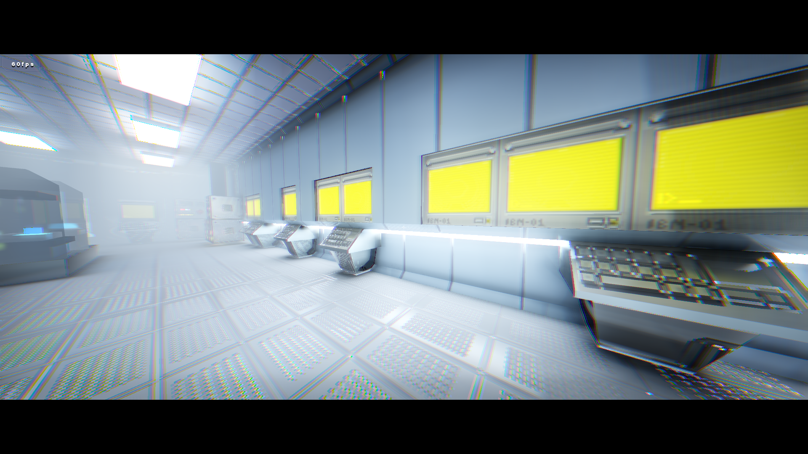
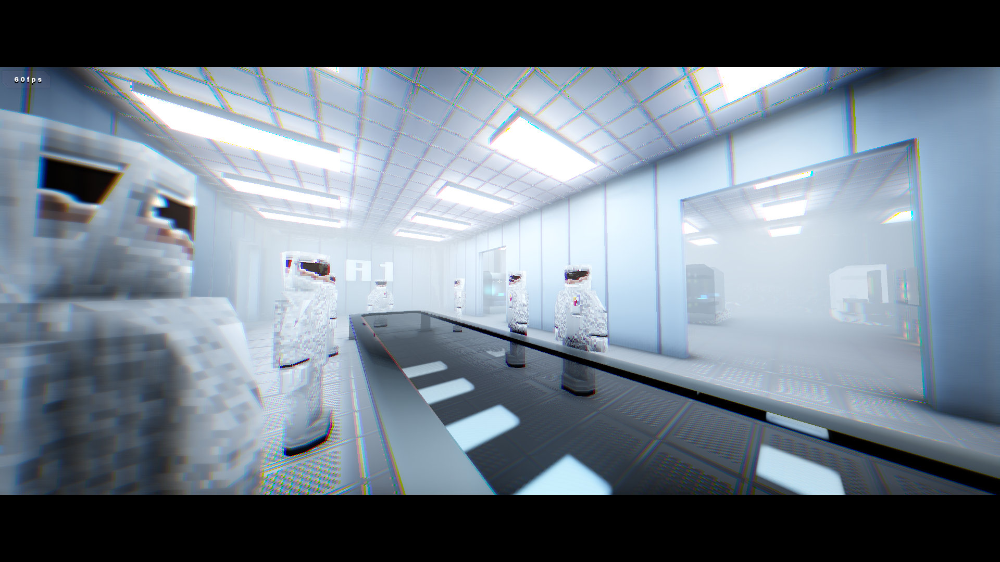
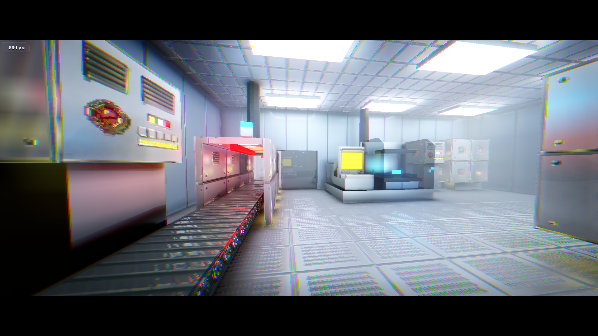
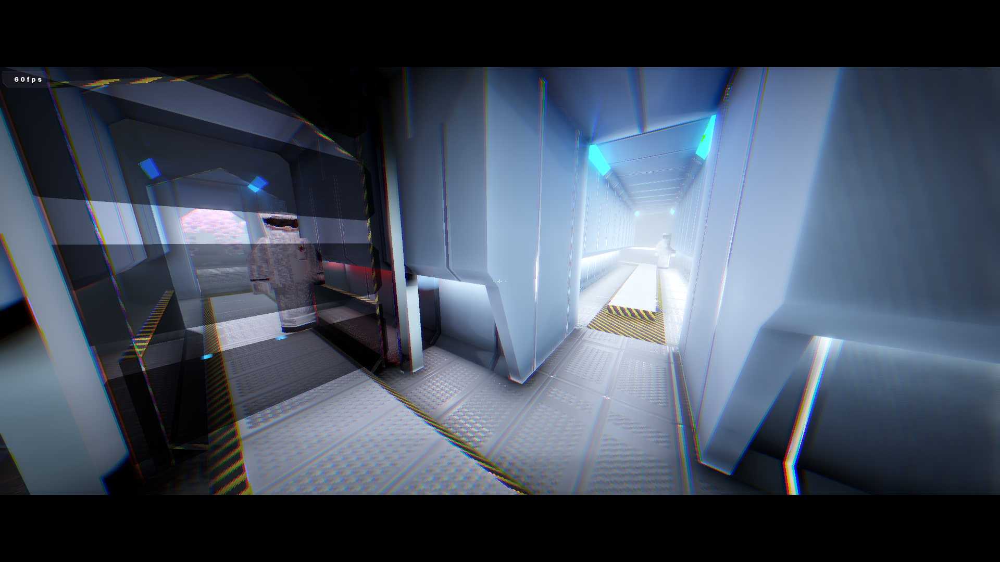
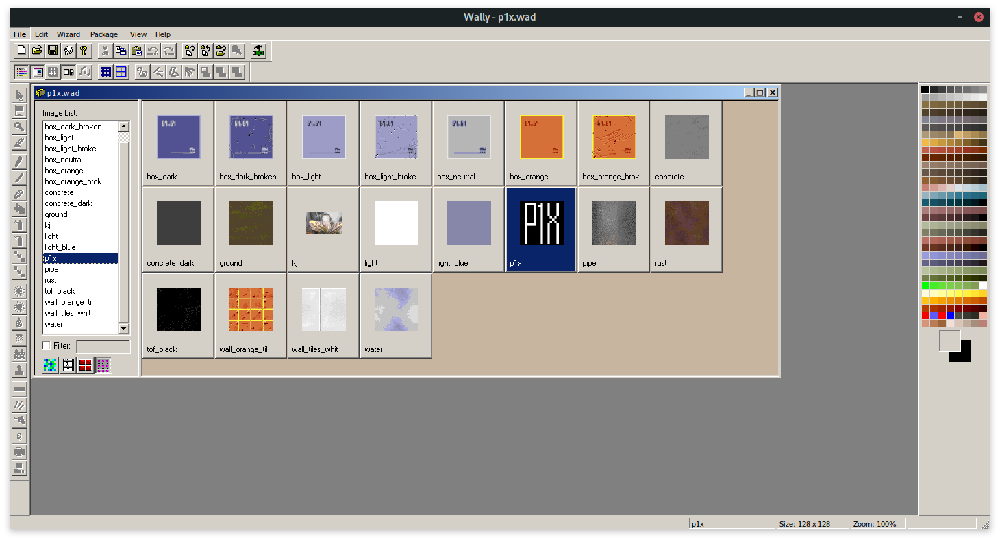
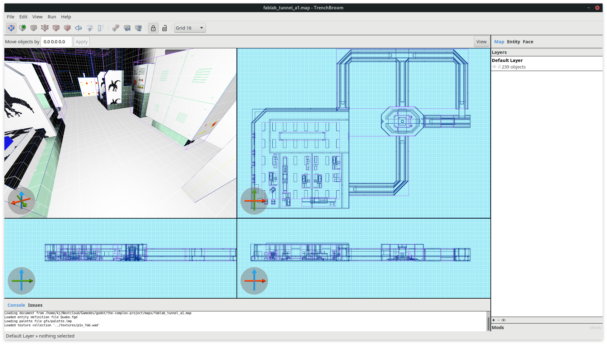
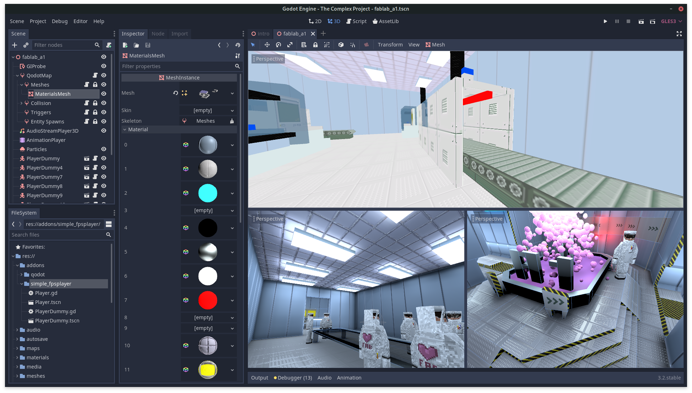

# The Complex Project

## About

### Project includes

- Working FPS Game
-- Single Player
-- Multiplayer Server (general purpose)
-- Multiplayer Client
- Loading Quake Maps via Qodot
- Creating maps via Trenchbroom
- Creating and polishing pixel-art 64x64 textures via Wally.exe
- Creating HD materials for photorealistic lighting
- Lighting the scenes

### Reactions
Community reactions from twitter to the project showcases.

"Very inspiring. Tried trenchbroom+qodot because of your tweets. Just amazing." - @whatmeigel

"Wow! That is looking good!" - @mux213

"I really like the aesthetic of clean and somewhat abstract visuals with realistic lighting. This seems like it could become a great reference project for this art style in Godot!" - @hexaquo_

"This is seriously making me consider finally switching to Godot." - @blokatt

### Technology

- [GodotEngine](https://godotengine.org/)
- [Qodot plugin](https://github.com/Shfty/qodot-plugin)
- [Simple FPS Player addon](https://github.com/aarroz/simplefps)
- [Camera effects](https://github.com/P1X-in/godot_vendors/tree/master/p1x/camera_3d_effects)
- [TrenchBroom](https://kristianduske.com/trenchbroom/)
- [Wally.exe (textures)](https://gamebanana.com/tools/4774)

## Media

### Videos

- (first alpha) https://vimeo.com/389283465
- (v0.999) https://vimeo.com/391811258

### Screenshots

#### Wally

#### TrenchBroom

#### Godot Engine 3.2 + Qodot

